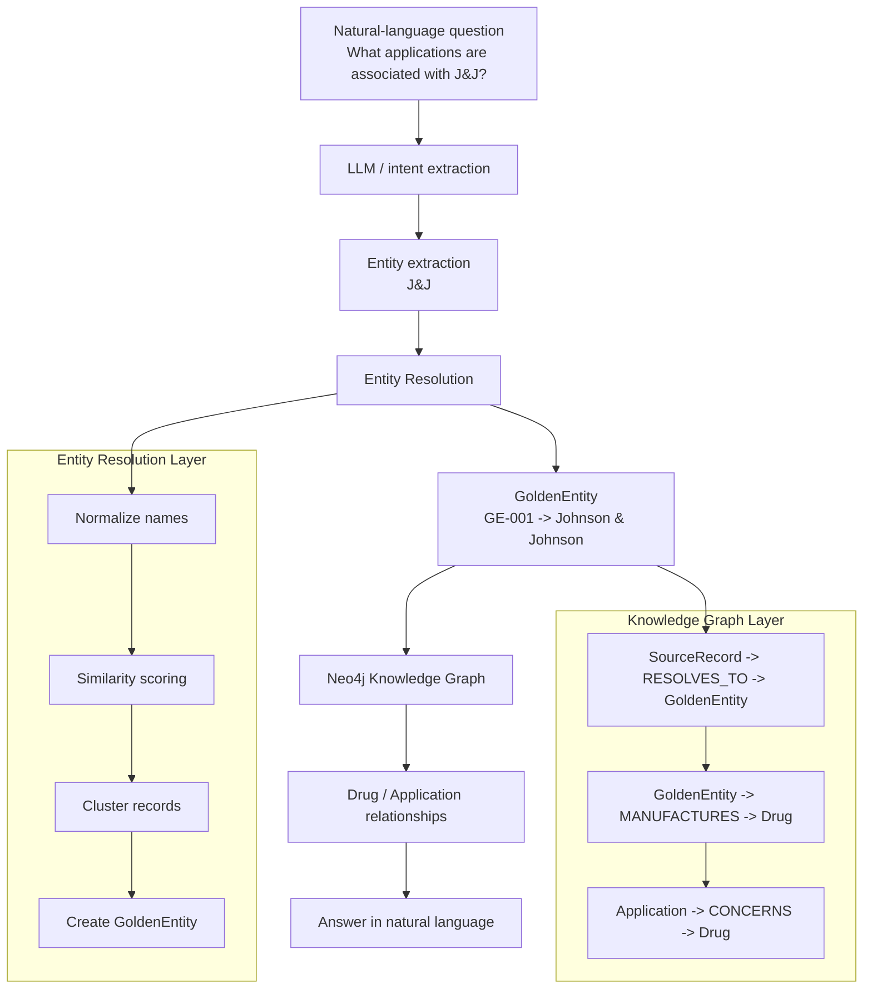

# ER + Knowledge Graph POC

This project demonstrates a simple end-to-end workflow for entity resolution (ER) and knowledge-graph querying using FDA-style company/facility records.

The core idea is:

- normalize messy source names such as `J&J`, `J and J`, and `Johnson and Johnson Inc.`
- resolve them to a canonical golden entity
- store the canonical entity and source records in Neo4j
- query the graph for related drugs and applications

## Workflow overview



## High-level architecture

```text
Python
  ├── pandas
  ├── RapidFuzz
  ├── NetworkX
  ├── Neo4j Python Driver
  └── python-dotenv
     ↓
Entity Resolution
     ↓
Golden Entities
     ↓
Neo4j AuraDB / graph storage
     ↓
LLM / natural-language layer
```

## Project structure

```text
er-knowledge-graph/
├── data/
│   └── companies.csv
├── er/
│   ├── normalize.py
│   ├── matcher.py
│   └── golden_entity.py
├── graph/
│   ├── connection.py
│   └── load_graph.py
├── agent/
│   └── query_graph.py
├── main.py
├── .env
├── .gitignore
├── requirements.txt
├── README.md
└── venv/
```

## Sample data model

The sample data in `data/companies.csv` is FDA-style and includes:

- `record_id`
- `source`
- `name`
- `facility_name`
- `address`
- `city`
- `state`
- `country`

Example records include variations such as:

- `Johnson & Johnson`
- `J&J`
- `Johnson and Johnson Inc.`
- `J and J`
- `Pfizer Inc`
- `Pfizer Incorporated`
- `Moderna Inc`

These records are intentionally noisy to show how entity resolution works in practice.

## Stage 1: Normalize names

`er/normalize.py` removes punctuation, standardizes `&` to `and`, strips legal suffixes like `Inc`, `Corp`, and `LLC`, and applies alias mapping.

Example:

```python
from er.normalize import normalize_company_name

print(normalize_company_name("Johnson & Johnson Inc."))
# johnson and johnson

print(normalize_company_name("J&J"))
# johnson and johnson
```

This step reduces naming noise before matching.

## Stage 2: Calculate similarity

`er/matcher.py` uses `RapidFuzz` to compare:

- company name
- address
- country

A weighted score is used:

- 60% name similarity
- 30% address similarity
- 10% country match

This is enough for a readable POC without using a full production ER stack.

## Stage 3: Build candidate matches

`main.py` loops over all records and compares pairs of records.

If the match score meets a threshold such as `0.75`, the pair is considered a candidate match.

Example output:

```text
Matches
{'record1': 1, 'record2': 2, 'score': 1.0}
{'record1': 1, 'record2': 3, 'score': 0.94}
{'record1': 1, 'record2': 4, 'score': 1.0}
...
```

## Stage 4: Create clusters and golden entities

The project uses a graph-based grouping approach via `networkx`:

- each record becomes a node
- matching records become edges
- connected components represent clusters

Example cluster result:

```text
{1, 2, 3, 4}
{5, 6}
{7}
```

Then each cluster is collapsed into a golden entity:

```text
GE-001 Johnson & Johnson
GE-002 Pfizer Inc
GE-003 Moderna Inc
```

This is the canonical record that the downstream graph relies on.

## Stage 5: Load the graph into Neo4j

The graph layer is defined in:

- `graph/connection.py`
- `graph/load_graph.py`

It creates relationships such as:

```cypher
(:SourceRecord)-[:RESOLVES_TO]->(:GoldenEntity)
(:GoldenEntity)-[:MANUFACTURES]->(:Drug)
(:Application)-[:CONCERNS]->(:Drug)
```

This gives the graph a clean canonical model while still preserving the source-of-truth records that fed the resolution process.

## Example graph structure

```text
SourceRecord: J&J
    └── RESOLVES_TO ──> GoldenEntity: Johnson & Johnson
                             └── MANUFACTURES ──> Drug: Sample Drug 1
                                                        └── CONCERNS ──> Application: APP-100
```

## Stage 6: Query the graph

The project includes an agent-style query layer in `agent/query_graph.py`.

The user flow is:

1. Extract entity from question: `J&J`
2. Resolve alias to canonical entity: `GE-001`
3. Query Neo4j for related applications
4. Return answer in natural language

Example Cypher pattern:

```cypher
MATCH (r:SourceRecord)-[:RESOLVES_TO]->(g:GoldenEntity)
WHERE toLower(r.name) = toLower($company_name)
OPTIONAL MATCH (g)-[:MANUFACTURES]->(d:Drug)<-[:CONCERNS]-(a:Application)
RETURN DISTINCT g.name AS golden_name, d.name AS drug_name, a.id AS application_id;
```

## Setup

Create a virtual environment and install dependencies:

```bash
cd er-knowledge-graph
python3 -m venv venv
source venv/bin/activate
pip install -r requirements.txt
```

Create a `.env` file with your Neo4j AuraDB credentials:

```env
NEO4J_URI=neo4j+s://your-instance.databases.neo4j.io
NEO4J_USERNAME=neo4j
NEO4J_PASSWORD=your-password
```

## Run the demo

```bash
python main.py
```

This will:

- read the sample FDA-style records
- resolve duplicates into golden entities
- print matches and clusters
- attempt to load the graph into Neo4j if credentials are configured

## Why this matters

This is a simplified version of the architecture you would eventually use in a real production system:

- ER for noisy source naming
- canonical entity graph for trusted identities
- graph database for relationship traversal
- LLM layer on top for natural-language interaction

The important design principle is:

> Do not ask the LLM to decide the canonical identity directly. Use an authoritative entity-resolution layer first, then query the graph.

That keeps the system deterministic and makes the graph a trustworthy source of truth.

## Next steps

Possible next improvements:

- add a more robust alias table for FDA registrants and facilities
- include facility-level records and site relationships
- add a real LLM wrapper for natural-language questions
- replace the demo data with actual FDA submissions or product datasets
- scale the ER layer with Spark or Databricks-based clustering
